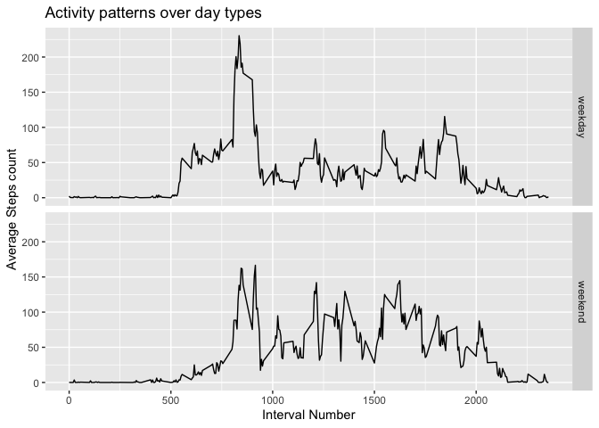

## Loading and preprocessing the data


```r
dat <- read.csv("data/activity.csv")
dat$date <- as.Date(as.character(dat$date), "%Y-%m-%d")
```

## What is mean total number of steps taken per day?

### 1. Total number of steps per day

```r
daily.steps <- aggregate(steps ~ date, data=dat, FUN=sum, na.rm=T)
```
### 2. Histogram of the total number of steps taken each day


```r
hist(daily.steps$steps, col="blue", xlab="Steps per day", ylab="Step count", main="")
```

<!-- -->

### 3. Summary statistics of daily steps


```r
summary(daily.steps$steps)
```

```
##    Min. 1st Qu.  Median    Mean 3rd Qu.    Max. 
##      41    8841   10765   10766   13294   21194
```

## What is the average daily activity pattern?

### 1. 5 minute interval plot against step count across all days


```r
interval.data <- aggregate(steps ~ interval, data=dat, FUN=mean, na.rm=T)
with(interval.data, plot(steps~interval, type="l", col="blue", xlab="Interval Number", ylab="Step count averaged over days", main="Averaged step counts for every time interval"))
```

<!-- -->

### 2. 5-minute interval with maximum average step count.


```r
max.interval <- interval.data[which(interval.data$steps == max(interval.data$steps)),]
```

The max interval is interval number 835 having a maximum average step count value of 206.17.

## Imputing missing values

### 1. Total number of missing values in the datase


```r
na.count <- sum(is.na(dat))
```

There are 2304 rows with missing values.

### 2. Strategy for imputing missing values


```r
dat$steps <- as.numeric(is.na(dat$steps))
missing.values <- aggregate(steps ~ date, data=dat, FUN=sum)

barplot(missing.values$steps, names=missing.values$date, main="Missing values per day")
```

<!-- -->

```r
missing.values <- aggregate(steps ~ interval, data=dat, FUN=sum)
barplot(missing.values$steps, names=missing.values$interval, main="Missing values per interval")
```

<!-- -->

Most days have no missing values, however, 8 days have over 250 missing values. In comparison, every interval has a very similar number of missing values.

A simple strategy to try will involve replacing a missing value with the mean for that time interval.

### 3. Imputing missing values


```r
dat <- read.csv("data/activity.csv")
dat$date <- as.Date(as.character(dat$date), "%Y-%m-%d")

mean.steps <- aggregate(steps ~ interval, data=dat, FUN=mean, na.rm=T)

dat$steps <- as.numeric(apply(dat, 1, function(x) if(is.na(x["steps"])) {mean.steps[mean.steps$interval == as.numeric(x["interval"]),"steps"]} else {x["steps"]} ))
```

### 4. Histogram with imputed missing values


```r
daily.steps <- aggregate(steps ~ date, data=dat, FUN=sum, na.rm=T)
hist(daily.steps$steps, col="blue", xlab="Steps per day", ylab="Step count", main="")
```

<!-- -->

```r
summary(daily.steps$steps)
```

```
##    Min. 1st Qu.  Median    Mean 3rd Qu.    Max. 
##      41    9819   10766   10766   12811   21194
```

The mean and median values have barely changed compared to the non-imputed case. Furthermore,
there is relatively minimal impact of imputing missing data on the estimates of the total daily number of steps, since both histograms show similar structures in form.


## Are there differences in activity patterns between weekdays and weekends?

### 1. Creating a new dataset with weekdays/ non-weekdays


```r
partition.days <- function(x) {
        if (weekdays(as.Date(x["date"])) == "Sunday" || weekdays(as.Date(x["date"])) == "Saturday") {
                return("weekend");
        } else {
                return("weekday");
        }
}

dat$day <- as.factor(apply(dat, 1, partition.days))
head(dat)
```

```
##       steps       date interval     day
## 1 1.7169811 2012-10-01        0 weekday
## 2 0.3396226 2012-10-01        5 weekday
## 3 0.1320755 2012-10-01       10 weekday
## 4 0.1509434 2012-10-01       15 weekday
## 5 0.0754717 2012-10-01       20 weekday
## 6 2.0943396 2012-10-01       25 weekday
```

### 2. Average daily steps against interval number across weekdays/ non-weekdays


```r
average.steps <- aggregate(steps ~ interval + day, data=dat, FUN=mean)

library(ggplot2)
g <- ggplot(average.steps, aes(interval, steps))
g + geom_line() + facet_grid(day~.) + labs(x ="Interval Number", y="Average Steps count", title="Activity patterns over day types")
```

<!-- -->

It appears that step activity starts earlier during the day for weekdays, whereas the overall step activity is sustained at a relatively higher level throughout the weekend.

